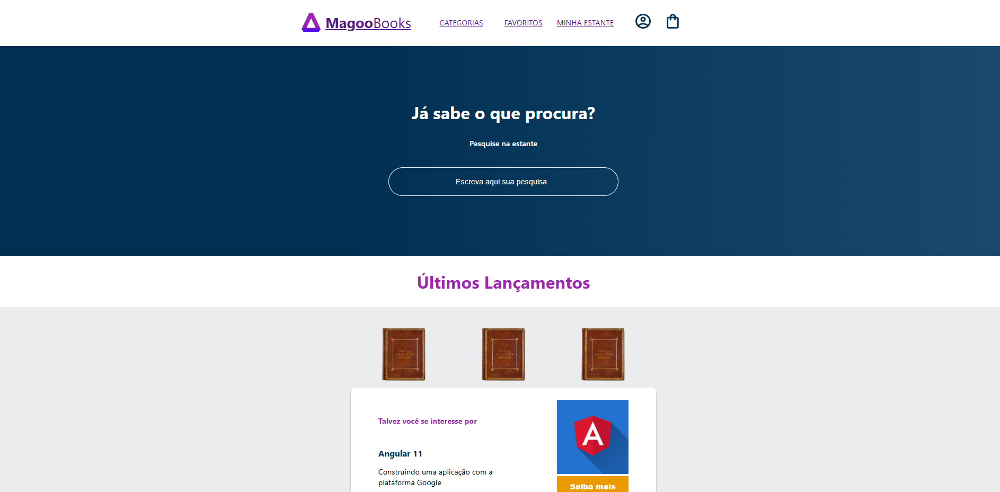
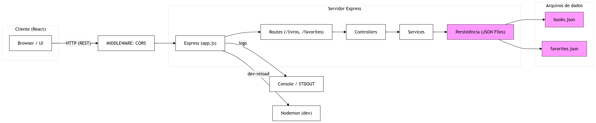

# Magoo Books

Magoo Books é uma aplicação web feita com React e Vite para explorar livros, buscar títulos em uma coleção, salvar favoritos e visualizar recomendações e lançamentos.

O projeto consome uma API REST local e possui integração com um back-end feito em Node.js e Express, responsável por expor os livros e os favoritos utilizados pela interface.

## Tecnologias utilizadas

- **React** (v18.2.0): Biblioteca para construir a interface de usuário com componentes reutilizáveis.
- **Vite** (v4.4.5): Ferramenta de build e servidor de desenvolvimento rápido usada para empacotar o projeto.
- **React Router DOM** (v6.16.0): Gerencia o roteamento cliente-side e a navegação entre telas.
- **Styled Components** (v6.0.7): Biblioteca CSS-in-JS para criar estilos encapsulados por componente.
- **Axios** (v1.5.0): Cliente HTTP usado para consumir a API do back-end.
- **Node.js** (v18+): Ambiente de execução JavaScript usado no back-end.
- **Express** (v4.x): Framework web para Node.js que expõe as rotas no back-end.

## Back-end

A interface foi criada para consumir um back-end em Node.js com Express, que fornece as rotas de livros e favoritos usadas pelo front-end.

**Repositório do back-end:** [magoo-books-server](https://github.com/Kaiorc/magoo-books-server)

## Exibição



## Funcionalidades

- Busca de livros por nome.
- Visualização de livros em destaque e lançamentos.
- Adição de livros aos favoritos.
- Listagem e remoção de livros favoritos.
- Navegação entre as rotas principal e favoritos.


## Estrutura

```text
magoo-books/
|-- index.html          # Documento base que recebe o app React.
|-- package.json        # Scripts e dependências do projeto.
|-- vite.config.js      # Configuração do Vite.
|-- README.md           # Documentação do projeto.
`-- src/                # Código-fonte da aplicação.
	|-- index.jsx         # Ponto de entrada da aplicação React.
	|-- assets/           # Arquivos estáticos usados na interface.
	|   `-- images/       # Imagens de capas e elementos visuais.
	|-- components/       # Componentes reutilizáveis da interface.
	|   |-- Header/       # Cabeçalho principal com navegação.
	|   |-- HeaderIcons/  # Ícones exibidos no cabeçalho.
	|   |-- HeaderOptions/ # Links e opções do menu superior.
	|   |-- Input/        # Campo de entrada usado na busca.
	|   |-- Logo/         # Logo da aplicação.
	|   |-- NewReleases/  # Seção de lançamentos recentes.
	|   |-- RecommendationCard/ # Card de recomendação de leitura.
	|   |-- Search/       # Bloco de pesquisa de livros.
	|   `-- Title/        # Componente de título reutilizável.
	|-- routes/           # Páginas principais da aplicação.
	|   |-- Favorites.jsx # Tela com os livros favoritos.
	|   `-- Home.jsx      # Tela inicial com busca e lançamentos.
	`-- services/         # Integração com a API.
		|-- books.js      # Funções para buscar livros.
		`-- favorites.js  # Funções para listar, salvar e remover favoritos.
```

## API utilizada pelo front-end

- Livros: `GET http://localhost:8000/livros/`
- Favoritos: `GET http://localhost:8000/favorites/`
- Adicionar favorito: `POST http://localhost:8000/favorites/:id`
- Remover favorito: `DELETE http://localhost:8000/favorites/:id`

## Observações

- O projeto foi pensado para rodar com o back-end já iniciado localmente.
- A busca é feita no front-end a partir dos dados retornados pela API.
- Os favoritos são persistidos pelo back-end.

## Instalação

1. Instale as dependências.

```bash
npm install
```

2. Inicie o front-end.

```bash
npm run dev
```

3. Garanta que o back-end esteja em execução em `http://localhost:8000`.

## Scripts

- `npm run dev`: inicia o ambiente de desenvolvimento.
- `npm run build`: gera a versão de produção.
- `npm run preview`: visualiza a build localmente.
- `npm run lint`: executa a análise de código.

## Arquitetura

Diagrama:

